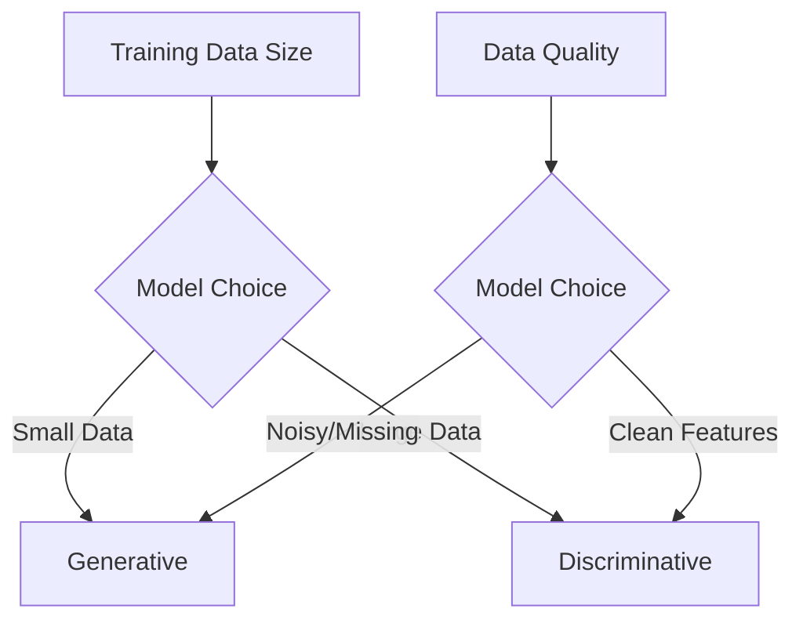

Exam Question 1: Discriminative vs. Generative Models
Explain the difference between discriminative and generative models in machine learning. In your answer, describe how each type handles classification tasks—especially in scenarios with out-of-distribution samples—and provide examples of algorithms that fall under each category. Discuss the advantages and limitations of both approaches.

# Discriminative vs. Generative Models

## 1. Fundamental Difference
```mermaid
graph LR
    A[Models] --> B[Discriminative]
    A --> C[Generative]
    B --> D[Learn P(y|x) - Decision Boundary]
    C --> E[Learn P(x|y) - Data Distribution]
```

## 2. Classification Approach
**Discriminative Models**:
- Directly model decision boundary between classes
- Estimate conditional probability P(y|x)
- Focus on separating different classes

**Generative Models**:
- Model joint probability P(x,y) through P(x|y)P(y)
- Learn data distribution for each class
- Use Bayes' theorem for inference: P(y|x) = P(x|y)P(y)/P(x)

## 3. Out-of-Distribution Handling
| Aspect                | Discriminative                     | Generative                      |
|-----------------------|------------------------------------|---------------------------------|
| Unknown Data Handling | May misclassify outliers           | Can estimate data likelihood    |
| Confidence Estimation | Limited uncertainty quantification | Natural probability estimates   |
| Example Scenario       | Image classifier fails on novel art| Spam filter detects new patterns|

## 4. Common Algorithms
**Discriminative**:
1. Logistic Regression
2. Support Vector Machines (SVM)
3. Decision Trees/Random Forests
4. Neural Networks (CNNs, Transformers)

**Generative**:
1. Naive Bayes Classifier
2. Linear Discriminant Analysis (LDA)
3. Gaussian Mixture Models (GMM)
4. Hidden Markov Models (HMM)

## 5. Advantages & Limitations

### Discriminative Models
**Advantages**:
- Typically better performance with sufficient data
- Focuses resources on decision boundaries
- Less computationally intensive
- Handles high-dimensional data better

**Limitations**:
- Cannot generate new samples
- Limited understanding of data structure
- Struggles with missing features

### Generative Models
**Advantages**:
- Can synthesize new data samples
- Handles missing data naturally
- Better at understanding data distributions
- Provides full probabilistic framework

**Limitations**:
- Requires careful feature engineering
- Computationally expensive for complex data
- May model irrelevant features
- Needs precise distribution assumptions

## 6. Practical Example: Email Classification
**Discriminative Approach**:
- Trains on word features to directly separate spam/ham
- Focuses on boundary words ("free", "offer" vs "meeting")

**Generative Approach**:
- Builds language models for spam/ham
- Calculates probability email was generated by spam model
- Can generate synthetic spam examples

## 7. Performance Characteristics

