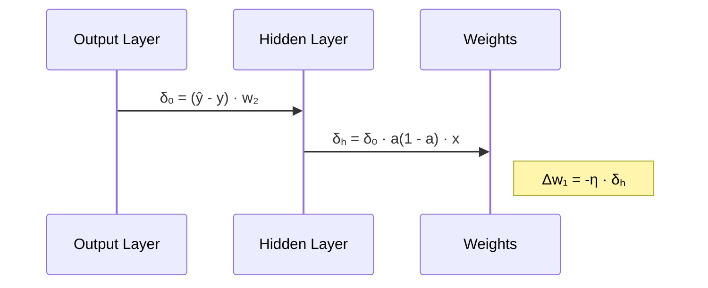

Exam Question 2: Backpropagation Derivation and Analysis
Consider a two-layer neural network with an input layer, a hidden layer using a sigmoid activation function, and an output layer with a linear activation. Derive the backpropagation formulas to update the weights. Specifically:

Derive the gradient of the error with respect to a hidden layer weight (e.g., 
𝑤
1
w 
1
​
 ).

Explain the role of the derivative of the sigmoid activation in your derivation.

Discuss how the error signal from the output layer propagates back to influence the weight updates in the hidden layer.

# Backpropagation Derivation Solution

## Network Architecture
```mermaid
graph LR
    x((x)) -->|w1| z[z = w1x + b1]
    z -->|σ| a((a = σ(z)))
    a -->|w2| y_hat[ŷ = w2a + b2]
    y((y)) --> E[E = ½(y-ŷ)²]
```

## 1. Gradient Derivation for Hidden Layer Weight (w₁)
Using chain rule through computational graph:

∂E/∂w₁ = ∂E/∂ŷ · ∂ŷ/∂a · ∂a/∂z · ∂z/∂w₁

### Step-by-Step Derivatives:
1. **Output Error**:  
   ∂E/∂ŷ = ŷ - y

2. **Output Layer Gradient**:  
   ∂ŷ/∂w₂ = a  
   ∂ŷ/∂a = w₂

3. **Sigmoid Derivative**:  
   ∂a/∂z = σ(z)(1 - σ(z)) = a(1 - a)

4. **Input Contribution**:  
   ∂z/∂w₁ = x

**Final Gradient**:  
∂E/∂w₁ = (ŷ - y) · w₂ · a(1 - a) · x

## 2. Role of Sigmoid Derivative
The sigmoid derivative σ'(z) = σ(z)(1 - σ(z)):
- Applies nonlinear transformation to error signals
- Acts as gradient attenuator:
  - → 0 when neurons are saturated (a ≈ 0 or 1)
  - Maximizes at a = 0.5 (σ' = 0.25)
- Causes vanishing gradients in deep networks
- Enables nonlinear decision boundaries

## 3. Error Signal Propagation


Key points:
- Error signal scales with weight w₂ from subsequent layer
- Each layer's gradient depends on subsequent layer's gradients
- Sigmoid derivative modulates error signal magnitude
- Input pattern (x) determines update direction

## Mathematical Formulation
Weight update rule:  
w₁ ← w₁ - η · [(ŷ - y) · w₂ · a(1 - a) · x]

Where:
- η = Learning rate
- (ŷ - y) = Output error
- w₂ = Output layer weight
- a(1 - a) = Sigmoid derivative
- x = Input activation

## Practical Considerations
- Initialize weights carefully to avoid saturation (σ' ≈ 0)
- Use batch normalization to mitigate vanishing gradients
- Consider ReLU alternatives for deeper networks
- Monitor gradient magnitudes during training
