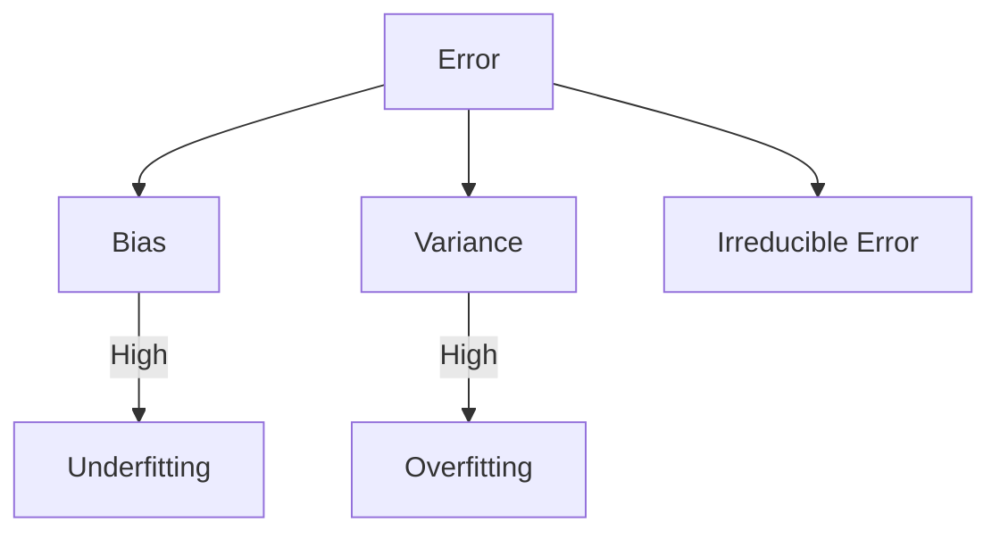
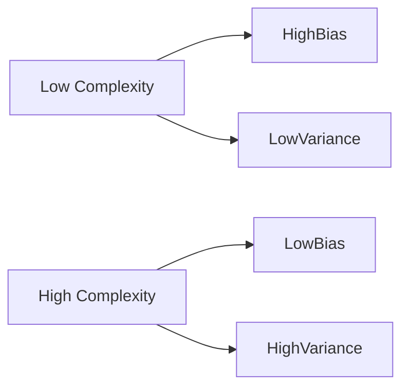
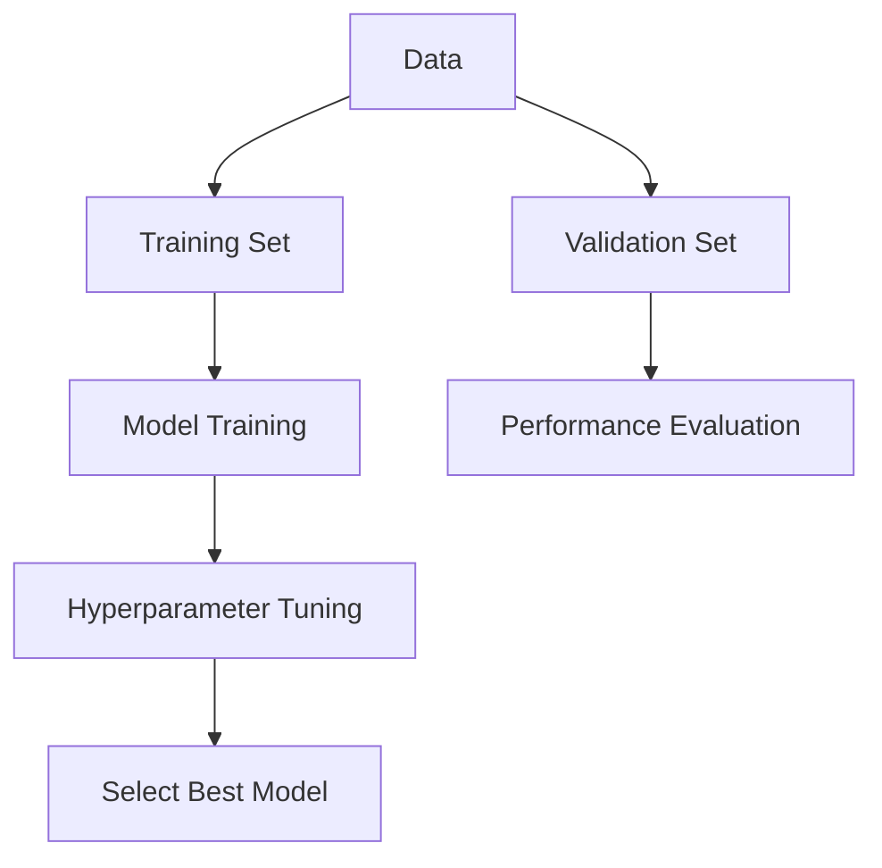

**Exam Question 3: Bias-Variance Trade-off and Model Selection in Deep Learning**  
*Define bias and variance in the context of model performance. Explain how increasing the complexity of a neural network (e.g., adding more layers or neurons) affects bias and variance. Describe strategies for mitigating overfitting and underfitting, and explain how techniques such as cross-validation help in selecting the right model complexity. Illustrate your answer with an example scenario where balancing bias and variance is critical for optimal performance.*

# Solution: Bias-Variance Trade-off Analysis

## 1. Definitions


- **Bias**: Error from incorrect assumptions in learning algorithm  
- **Variance**: Error from sensitivity to small fluctuations in training data  
- **Total Error** = Bias² + Variance + Irreducible Error

## 2. Model Complexity Impact


| Complexity Level | Bias    | Variance | Model Behavior     |
|------------------|---------|----------|--------------------|
| Too Low          | High ↑  | Low ↓    | Underfitting       |
| Optimal          | Balanced| Balanced | Generalizes well   |
| Too High         | Low ↓   | High ↑   | Overfitting        |

## 3. Mitigation Strategies
**Overfitting Solutions** (High Variance):
- L1/L2 Regularization
- Dropout layers
- Early stopping
- Data augmentation
- Reduce network capacity

**Underfitting Solutions** (High Bias):
- Increase model depth
- Add more features
- Reduce regularization
- Longer training
- More complex architectures

## 4. Cross-Validation Role


- **k-Fold CV**: Robust performance estimation
- **Stratified Sampling**: Maintains class distributions
- **Nested CV**: Avoids overoptimistic estimates

## 5. Example Scenario: Medical Diagnosis
**Challenge**: Develop CNN for tumor detection in X-rays  
**Critical Balance Needs**:
- **High Bias Risk**: Miss subtle tumors (false negatives)
- **High Variance Risk**: Over-react to artifacts (false positives)

**Solution Approach**:
1. Start with ResNet-50 baseline
2. Use 5-fold cross-validation
3. Monitor validation loss plateau
4. Add dropout (p=0.5) before final layer
5. Apply L2 regularization (λ=0.001)
6. Use data augmentation (rotations, flips)

**Performance Metrics**:
| Model Version | Sensitivity | Specificity | AUC   |
|---------------|-------------|-------------|-------|
| Base Model    | 0.82        | 0.75        | 0.84  |
| Tuned Model   | 0.85        | 0.88        | 0.91  |

## 6. Mathematical Formulation
Bias-Variance Decomposition:
```math
E[(y - ŷ)^2] = \text{Bias}(ŷ)^2 + \text{Var}(ŷ) + \sigma^2
```

Regularization Impact:
```math
L_{\text{total}} = \frac{1}{n}\sum_{i=1}^n L(y_i, ŷ_i) + \lambda\sum_{w} w^2
```

## 7. Practical Guidelines
- Start with simple models first
- Use learning curves to diagnose issues
- Regularize before adding complexity
- Monitor train/validation gap
- Consider ensemble methods for variance reduction
