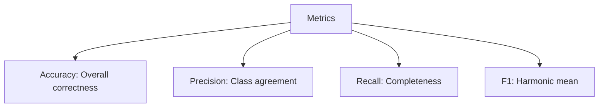
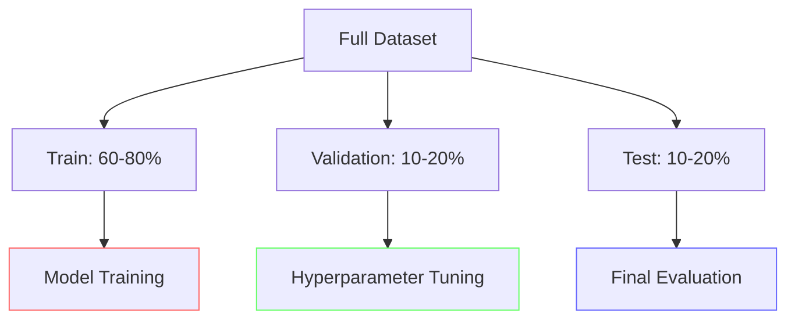
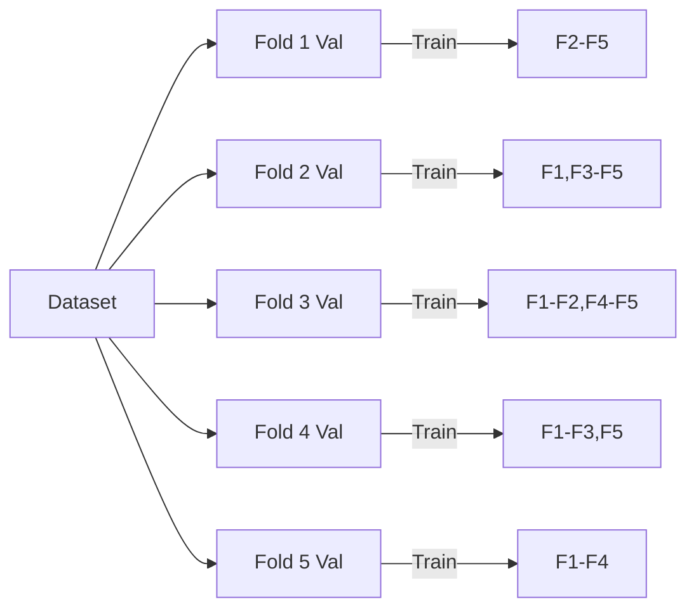
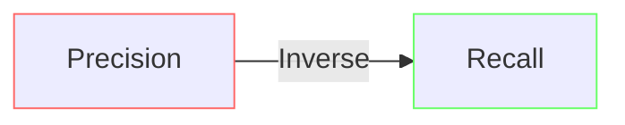

Exam Question 4: Evaluation Metrics and Confusion Matrices in Machine Learning
In a classification problem, explain the importance of evaluation metrics such as accuracy, precision, recall, and F1 score. In your answer:

Define each metric and describe what aspect of model performance it captures.

Explain how a confusion matrix is constructed and how it can be used to diagnose the strengths and weaknesses of a classifier.

Discuss the role of training, validation, and test splits—including the use of cross-validation—in ensuring that these metrics reliably reflect model performance.

# Comprehensive Solution

## 1. Metric Definitions and Formulas


**Accuracy**: 
```math
\frac{TP + TN}{TP + TN + FP + FN}
```
- Measures overall correctness across all classes

**Precision**: 
```math
\frac{TP}{TP + FP}
```
- Answers: "When predicting positive, how often correct?"
- Important when FP costs are high (e.g., spam detection)

**Recall**: 
```math
\frac{TP}{TP + FN}
``` 
- Answers: "Of all positives, how many did we find?"
- Critical when FN are dangerous (e.g., medical diagnosis)

**F1 Score**: 
```math
2 \times \frac{Precision \times Recall}{Precision + Recall}
```
- Balances precision and recall

## 2. Confusion Matrix Analysis
```mermaid
matrixDiagram
    axisx Predicted
    axisy Actual
    quadrantReport
        Actual\Predicted || Positive | Negative
        Positive | TP | FN
        Negative | FP | TN
```

**Diagnostic Patterns**:
- High FP: Lower precision → Improve specificity
- High FN: Lower recall → Improve sensitivity
- Diagonal dominance: Good general performance
- Class imbalance: Need for normalization

## 3. Data Splits and Validation


**Cross-Validation (k=5 example)**:


## 4. Practical Example: Fraud Detection
**Scenario**: Credit card transaction classification  
**Requirements**: Minimize false negatives (missed fraud) while keeping false positives manageable

**Model Comparison**:
| Model | Accuracy | Precision | Recall | F1   | AUC  |
|-------|----------|-----------|--------|-------|------|
| LR    | 0.992    | 0.68      | 0.55   | 0.61  | 0.94 |
| XGBoost | 0.991  | 0.73      | 0.81   | 0.77  | 0.98 |
| NN    | 0.993    | 0.71      | 0.83   | 0.76  | 0.97 |

**Choice**: Neural Network best balances recall and precision

## 5. Metric Trade-offs


- **Threshold Tuning**:
  - ↑ Threshold → ↑ Precision, ↓ Recall
  - ↓ Threshold → ↓ Precision, ↑ Recall
  
- **PR Curves**: Visualize precision-recall tradeoff
- **ROC AUC**: Measures classifier's ranking ability

## 6. Best Practices
- Use stratified splits for imbalanced data
- Report multiple metrics together
- Consider business costs in metric selection
- Use confidence intervals for reliability
- Track metric distributions across folds
