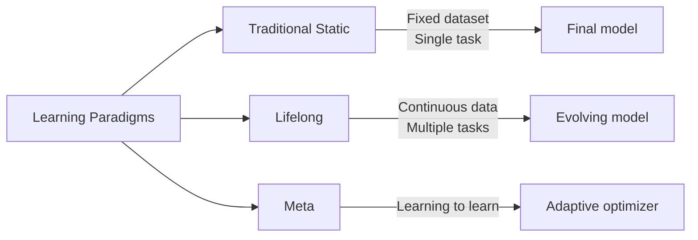
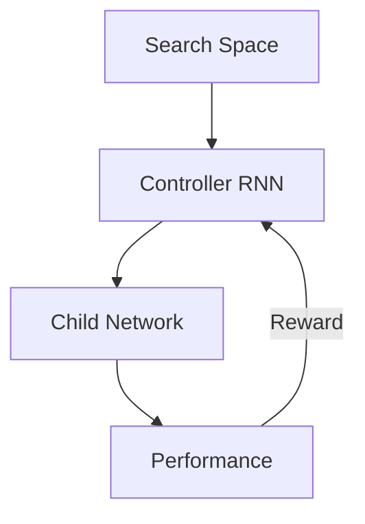
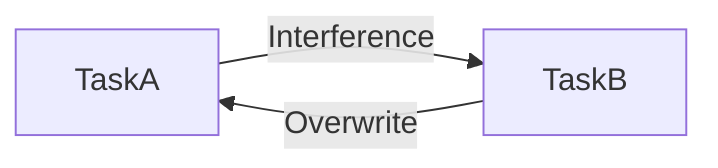
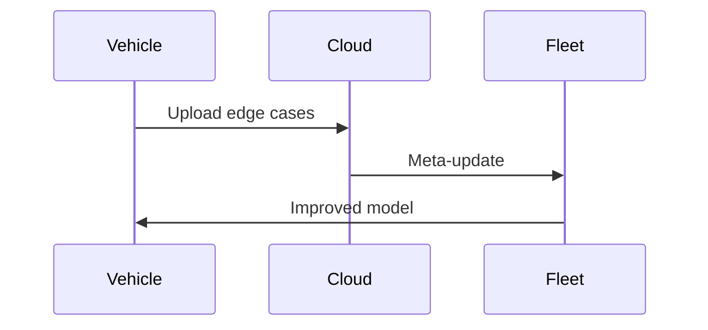

Exam Question 5: Lifelong Learning and Meta-Learning in Deep Neural Networks
Discuss the concepts of lifelong learning and meta-learning as they apply to deep neural networks. In your answer:

Define lifelong learning and meta-learning and explain how they differ from traditional static training paradigms.

Describe how a meta-learning framework can be used to optimize hyperparameters or adapt model architectures over time.

Discuss the challenges associated with implementing lifelong learning systems, including issues like catastrophic forgetting and data distribution shifts.

Provide examples of real-world applications where these paradigms offer significant advantages over traditional training methods.

# Solution: Advanced Learning Paradigms

## 1. Fundamental Concepts


**Lifelong Learning**:
- Continuously learns from streaming data
- Accumulates knowledge over time
- Adapts to new tasks without forgetting

**Meta-Learning**:
- "Learning how to learn"
- Optimizes learning algorithms
- Rapid adaptation to new tasks

## 2. Meta-Learning Framework
**Model-Agnostic Meta-Learning (MAML)**:
```math
\min_\theta \sum_{\mathcal{T}_i \sim p(\mathcal{T})} \mathcal{L}_{\mathcal{T}_i}(f_{\theta'_i})
```
where:
```math
\theta'_i = \theta - \alpha \nabla_\theta \mathcal{L}_{\mathcal{T}_i}(f_\theta)
```

**Architecture Search**:


## 3. Key Challenges
**Catastrophic Forgetting**:


**Mitigation Strategies**:
- Elastic Weight Consolidation (EWC)
- Progressive Neural Networks
- Memory Replay Buffers

**Data Shift Types**:
| Type          | Description                  | Impact               |
|---------------|------------------------------|----------------------|
| Covariate     | Input distribution changes   | Feature mismatch     |
| Concept       | P(y|x) changes               | Label semantics shift|
| Prior         | Class balance changes        | Bias in predictions  |

## 4. Real-World Applications

**Medical Diagnostics**:
- Adapt to new imaging modalities
- Personalize to patient subgroups
- Handle evolving disease profiles

**Autonomous Vehicles**:


**Smart Assistants**:
- Learn new user preferences
- Adapt to linguistic shifts
- Preserve privacy through local learning

## 5. Performance Comparison
| Approach         | Training Time | Adaptation Speed | Memory Efficiency |
|------------------|---------------|-------------------|--------------------|
| Traditional      | Fast          | Slow              | High               |
| Lifelong         | Continuous    | Moderate          | Medium             |
| Meta-Learning    | Slow          | Very Fast         | Low                |

## 6. Implementation Considerations
- Use task descriptors for lifelong learning
- Implement gradient checkpointing
- Balance meta-batch diversity
- Monitor forward/backward transfer
- Deploy uncertainty estimation
