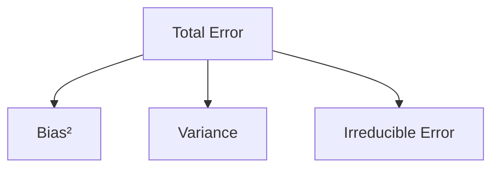
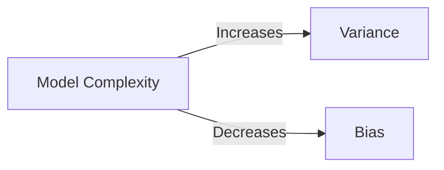
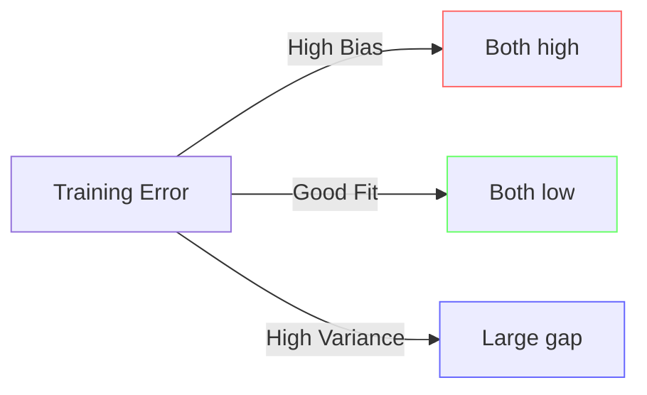
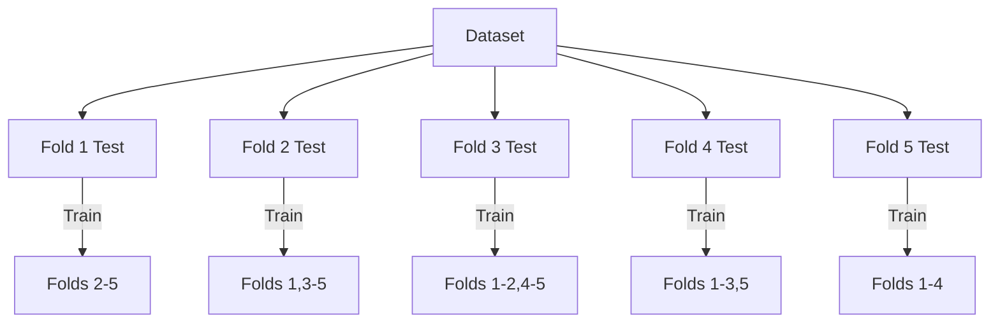

Exam Question 6: Bias-Variance Trade-off and Model Selection

Discuss the concepts of bias and variance in the context of machine learning model selection. Your answer should include:

A clear definition of bias and variance, and how each affects model performance.

An explanation of the bias-variance dilemma as it relates to overfitting and underfitting.

A discussion of how techniques such as data splitting (training, validation, and test sets) and cross-validation help in achieving the right balance in hyperparameter tuning.

# Comprehensive Solution

## 1. Core Definitions


**Bias**:  
```math
\text{Bias} = E[\hat{f}(x) - f(x)]
```
- Error from incorrect model assumptions  
- High bias → Underfitting (misses patterns)

**Variance**:  
```math
\text{Variance} = E[(\hat{f}(x) - E[\hat{f}(x)])²]
```  
- Error from sensitivity to training data fluctuations  
- High variance → Overfitting (fits noise)

## 2. Bias-Variance Trade-off


**Learning Curves**:


## 3. Data Splitting Strategy
**Typical Split**:
| Set         | Size   | Purpose               |
|-------------|--------|-----------------------|
| Training    | 60-70% | Model fitting         |
| Validation  | 15-20% | Hyperparameter tuning |
| Test        | 15-20% | Final evaluation      |

**k-Fold Cross-Validation (k=5)**:


## 4. Hyperparameter Tuning Example
**Decision Tree Depth Selection**:
| Depth | Train MSE | Val MSE  | Bias    | Variance |
|-------|-----------|----------|---------|----------|
| 2     | 4.2       | 4.5      | High ↑  | Low ↓    |
| 5     | 3.1       | 3.3      | Medium  | Medium   |
| 10    | 1.2       | 3.8      | Low ↓   | High ↑   |

**Optimal Choice**: Depth 5 balances bias and variance

## 5. Practical Implementation
**House Price Prediction**:
1. Split data using stratified sampling
2. Train models with varying regularization
3. Evaluate on validation set:
   ```python
   for lambda in [0.001, 0.01, 0.1, 1]:
       model = Ridge(alpha=lambda).fit(X_train, y_train)
       scores.append(mean_squared_error(y_val, model.predict(X_val)))
   ```
4. Select λ with best validation performance
5. Final test on held-out set

## 6. Mathematical Formulation
**Bias-Variance Decomposition**:
```math
E[(y - \hat{f}(x))²] = \text{Bias}[\hat{f}(x)]² + \text{Var}[\hat{f}(x)] + \sigma²
```

**Regularization Impact**:
```math
\hat{\beta} = \argmin_{\beta} \left\{ \sum_{i=1}^n (y_i - x_i^T\beta)^2 + \lambda\sum_{j=1}^p \beta_j² \right\}
```

## 7. Best Practices
- Use early stopping for neural networks
- Implement nested cross-validation
- Monitor learning curves
- Consider ensemble methods
- Apply dimensionality reduction
