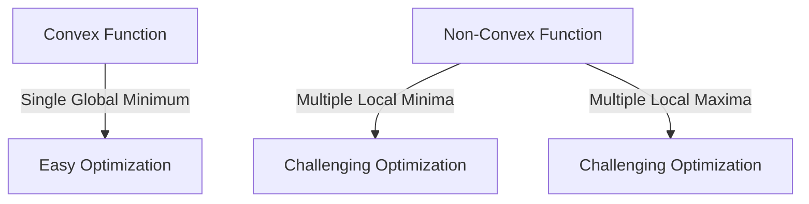

# Solution to Question 10: Non-Convex Optimization and Gradient Descent Methods

## 1. Convex vs. Non-Convex Functions

### Convex Functions
- A function \( f(x) \) is convex if the line segment between any two points on the graph of the function lies above the graph.
- Mathematically, \( f(\lambda x_1 + (1-\lambda)x_2) \leq \lambda f(x_1) + (1-\lambda)f(x_2) \) for all \( x_1, x_2 \) and \( \lambda \in [0, 1] \).
- Example: Mean Squared Error (MSE) in linear regression.

### Non-Convex Functions
- A function \( f(x) \) is non-convex if it does not satisfy the convexity condition.
- Non-convex functions can have multiple local minima and maxima.
- Example: Loss surfaces in deep neural networks.

### Visual Representation

## 2. Non-Convex Loss Surfaces in Deep Learning

### Multiple Local Minima
- Non-convex loss surfaces can have multiple local minima.
- Local minima can be sharp or wide.
- Sharp minima: High sensitivity to parameter changes, poor generalization.
- Wide minima: Low sensitivity to parameter changes, better generalization.

### Implications for Model Generalization
- Models converging to sharp minima may overfit to training data.
- Models converging to wide minima are more likely to generalize well to unseen data.

## 3. Gradient Descent Methods in Non-Convex Settings

### Gradient Descent
- Iteratively updates model parameters in the direction of the negative gradient of the loss function.
- Can get trapped in local minima in non-convex settings.

### Mini-Batch Gradient Descent
- Uses small batches of data to compute gradients.
- Introduces noise in gradient estimates.
- Noise helps escape sharp, narrow minima and explore wider regions of the loss surface.

### Example:
For a dataset with 1000 samples and batch size of 100:
- Each iteration updates the model using 100 samples.
- Noise in gradients helps avoid suboptimal local minima.

## 4. Practical Considerations

**When to Use Mini-Batch Gradient Descent**:
- When training deep neural networks with non-convex loss surfaces.
- When avoiding sharp minima is important for generalization.

**When to Use Full-Batch Gradient Descent**:
- When computational resources allow.
- When stable gradient estimates are needed.

**Hybrid Approach**:
- Start with mini-batch gradient descent to explore the loss surface.
- Switch to full-batch gradient descent for fine-tuning.
