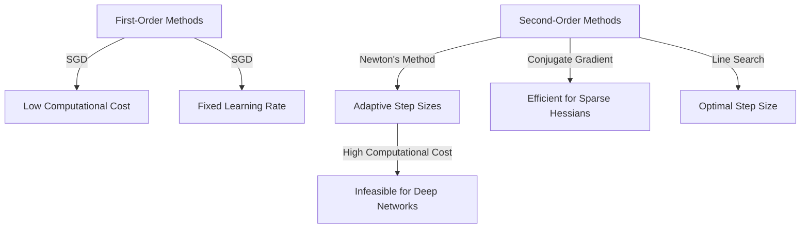

# Solution to Question 11: Second-Order Optimization Methods vs. First-Order Methods

## 1. First-Order Methods

### Stochastic Gradient Descent (SGD)
- Uses first-order derivatives (gradients) to update model parameters.
- Iteratively updates parameters in the direction of the negative gradient of the loss function.
- Simple and computationally efficient.

### Advantages
- Low computational cost per iteration.
- Suitable for large-scale problems.

### Limitations
- Fixed learning rate can lead to slow convergence.
- Sensitive to the choice of learning rate.
- May get trapped in local minima.

## 2. Second-Order Methods

### Newton's Method
- Uses second-order derivatives (Hessian matrix) to update model parameters.
- Iteratively updates parameters using curvature information.
- Adaptive step sizes derived from curvature information.

### Conjugate Gradient
- An iterative method for solving linear systems with positive-definite matrices.
- Efficient for large-scale problems where the Hessian is sparse.

### Line Search
- Combines gradient information with a search along a direction to find an optimal step size.
- Balances exploration and exploitation.

### Advantages
- Faster convergence in certain contexts.
- Adaptive step sizes improve optimization efficiency.

### Limitations
- High computational cost due to the Hessian matrix.
- Infeasible for deep networks with millions of parameters.

### Visual Representation

## 3. Practical Adaptations

### Momentum
- Accumulates a velocity vector in the direction of the gradient.
- Helps accelerate convergence and escape local minima.

### Adaptive Learning Rates (Adam)
- Combines the advantages of AdaGrad and RMSProp.
- Adjusts learning rates based on first and second moments of the gradients.
- Captures some benefits of second-order information without high computational costs.

### Example:
For a dataset with 1000 samples:
- Momentum helps smooth out noisy gradients.
- Adam adapts learning rates to improve convergence.

## 4. Practical Considerations

**When to Use First-Order Methods**:
- When computational resources are limited.
- When dealing with large-scale problems.

**When to Use Second-Order Methods**:
- When faster convergence is needed.
- When the problem size is manageable.

**Hybrid Approach**:
- Use first-order methods with practical adaptations (e.g., momentum, Adam) to capture some benefits of second-order information.
- Switch to second-order methods for fine-tuning if computationally feasible.
