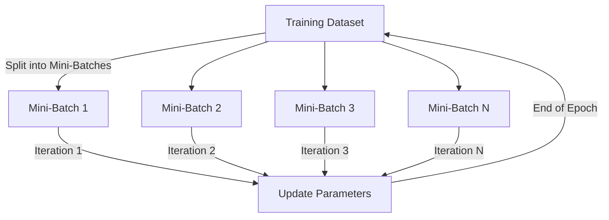

# Solution to Question 12: Interaction Between Batch Size, Learning Rate, and Convergence

## 1. Definitions of Iteration and Epoch

### Iteration
- One update of the model parameters using a single mini-batch.

### Epoch
- One complete pass through the entire training dataset.

### Relationship Between Batch Size and Iterations
- The batch size determines the number of iterations per epoch.
- For a dataset with \( N \) samples and batch size \( B \):
  \[
  \text{Iterations per Epoch} = \frac{N}{B}
  \]

### Visual Representation

## 2. Impact of Batch Size on Gradient Estimates

### Large Batch Size
- Reduces noise in gradient estimates.
- Provides stable gradients.
- May converge quickly to sharp minima.

### Small Batch Size
- Introduces more noise in gradient estimates.
- Helps escape sharp, narrow minima.
- Encourages convergence to wide, flat minima.

### Example:
For a dataset with 1000 samples:
- Large batch size (e.g., 512) provides stable gradients.
- Small batch size (e.g., 32) introduces noise, aiding exploration.

## 3. Tuning Learning Rate in Relation to Batch Size

### Large Batch Size
- Can use a larger learning rate.
- Stable gradients allow for more aggressive updates.

### Small Batch Size
- Requires a smaller learning rate.
- Noisy gradients necessitate cautious updates.

### Strategies for Tuning Learning Rate
- **Learning Rate Schedules**: Gradually decrease the learning rate during training.
- **Warm-Up**: Start with a small learning rate and gradually increase it.
- **Adaptive Learning Rates**: Use methods like Adam to adjust learning rates based on gradient statistics.

### Implications for Convergence
- Large batch size with a large learning rate may converge quickly but risk sharp minima.
- Small batch size with a small learning rate may converge slowly but favor wide minima.

## 4. Practical Considerations

**When to Use Large Batch Size**:
- When computational resources allow.
- When faster convergence is needed.

**When to Use Small Batch Size**:
- When memory is limited.
- When better generalization is desired.

**Hybrid Approach**:
- Start with a small batch size and small learning rate for exploration.
- Gradually increase batch size and learning rate for exploitation.
