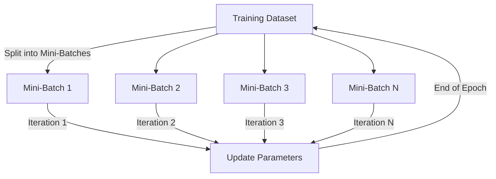

# Solution to Question 8: Mini-Batch Gradient Descent, Iterations, and Epochs

## 1. Mini-Batch Gradient Descent

Mini-batch gradient descent is a variant of gradient descent where the training dataset is divided into small batches. Each batch is used to compute the gradient and update the model parameters.

### Definitions

- **Iteration**: One update of the model parameters using a single mini-batch.
- **Epoch**: One complete pass through the entire training dataset.

### Training Process

## 2. Effect of Batch Size on Gradient Estimates

- **Small Batch Size**:
  - Introduces more noise in gradient estimates.
  - Helps explore wider regions of the loss surface.
  - Can lead to better generalization.

- **Large Batch Size**:
  - Reduces noise in gradient estimates.
  - Converges quickly to local minima.
  - May lead to poorer generalization.

### Example:
For a dataset with 1000 samples and batch size of 100:
- 1 Epoch = 10 Iterations
- Each iteration updates the model using 100 samples.

## 3. Trade-Offs in Batch Size Selection

### Small Batch Size
**Advantages**:
- Better generalization due to noisy updates.
- Requires less memory.

**Limitations**:
- Slower convergence.
- Higher variance in gradient estimates.

### Large Batch Size
**Advantages**:
- Faster convergence.
- More stable gradient estimates.

**Limitations**:
- Requires more memory.
- May lead to poorer generalization.

## 4. Practical Considerations

**When to Use Small Batch Size**:
- When memory is limited.
- When better generalization is desired.

**When to Use Large Batch Size**:
- When faster convergence is needed.
- When memory is not a constraint.

**Hybrid Approach**:
- Start with a small batch size for better generalization.
- Gradually increase the batch size as training progresses to speed up convergence.
