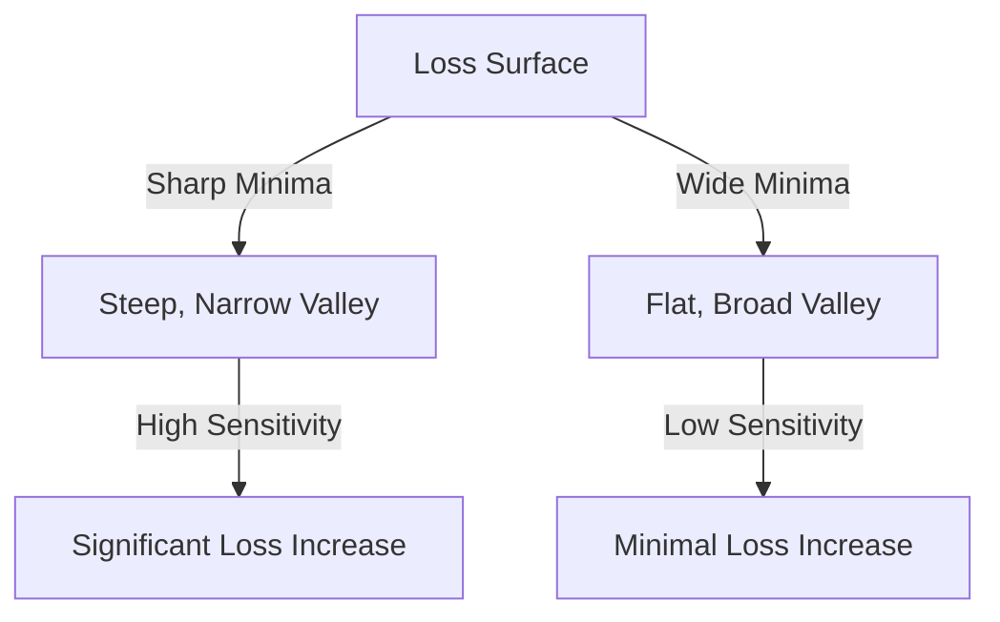

# Solution to Question 9: Loss Surface Characteristics and the Impact of Batch Size

## 1. Sharp Minima vs. Wide Minima

### Geometry and Sensitivity

- **Sharp Minima**:
  - Characterized by steep, narrow valleys in the loss surface.
  - High sensitivity to changes in parameters.
  - Small perturbations in parameters can lead to significant increases in loss.

- **Wide Minima**:
  - Characterized by flat, broad valleys in the loss surface.
  - Low sensitivity to changes in parameters.
  - Small perturbations in parameters have minimal impact on loss.

### Visual Representation

## 2. Impact of Batch Size on Minima

- **Small Batch Size**:
  - Introduces more noise in gradient estimates.
  - Helps escape sharp, narrow minima.
  - Encourages convergence to wide, flat minima.

- **Large Batch Size**:
  - Reduces noise in gradient estimates.
  - May converge quickly to sharp, narrow minima.
  - Less likely to escape local minima.

### Example:
For a dataset with 1000 samples:
- Small batch size (e.g., 32) introduces more noise, aiding exploration.
- Large batch size (e.g., 512) provides stable gradients, aiding exploitation.

## 3. Implications for Generalization Performance

- **Sharp Minima**:
  - Models may overfit to training data.
  - Poor generalization to unseen data.
  - Sensitive to small changes in input data.

- **Wide Minima**:
  - Models are more robust to variations in input data.
  - Better generalization to unseen data.
  - Less likely to overfit.

### Practical Considerations

**When to Aim for Wide Minima**:
- When generalization performance is critical.
- When training data is noisy or limited.

**When to Aim for Sharp Minima**:
- When training data is abundant and clean.
- When faster convergence is desired.

**Hybrid Approach**:
- Use small batch sizes initially to explore the loss surface.
- Gradually increase batch size to exploit stable regions.
